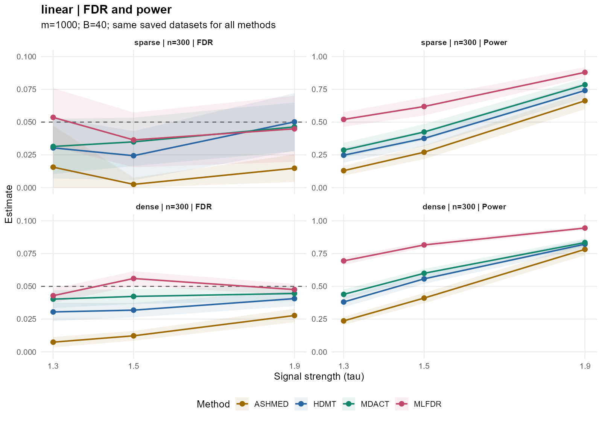
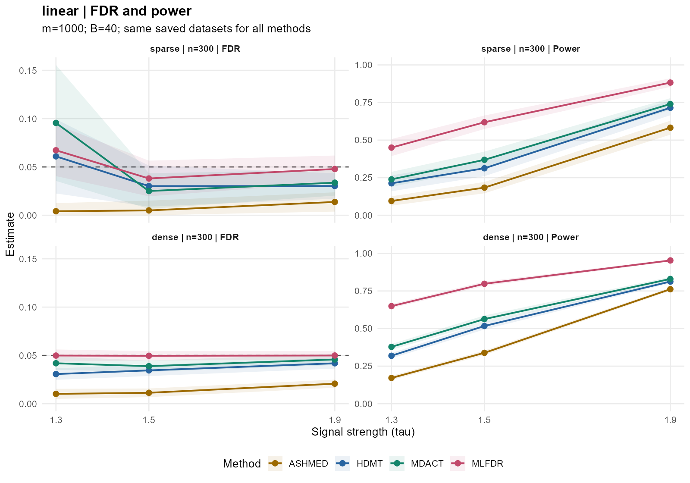

# ASHMED 两套已存数据比较：实际运行报告

第三notebook按ASHMED附件第2.1–2.2节独立实现数学方法，未采用其模拟实验设计。读取01与02已经生成的两套正式数据，**没有重新生成原始数据**。

新增方法的模型设定预先固定为J=12、r_min=0.25、r_max=8、ρ∈{−0.5,0,0.5}，共61个零中心same-scale成分；初始π按附件相对值归一化。相对似然阈值1e−8、KKT gap阈值1e−4、最大5000轮，全量1000条路径拟合。收敛保护及共轭后验效应矩是明确说明的补全。

两套均保留n=300、m=1000、τ=1.3/1.5/1.9、3场景×2混合、每条件40次、q=0.05、原三个方法与选项、FDR/Power/MCSE/近似95%区间和重复内配对比较。每套720份、2880次方法调用；总计1440份、5760次，其中ASHMED新增1440次，原三方法4320次复用历史缓存。

## 逐套结果

### paper_adjusted

- 已存manifest：`data_f87521c2b4eb/manifest.rds`。
- 新结果：`results/run_76428dee9701`。
- 成功调用2880/2880；ASHMED警告0；保留原方法历史警告960次。
- ASHMED收敛720/720；最大轮数1597；最大KKT gap=9.98439e-05。
- 原方法2160条逐次记录的R/V/S/A/FDP/Power均保持一致，CSV读写浮点误差至多5e-16。
- 原始数据MD5匹配720/720；修改时间与manifest均未变。

线性、密集、τ=1.5的40次重复结果：

| 方法 | 经验FDR | FDR MCSE | Power | Power MCSE |
|:--|--:|--:|--:|--:|
| HDMT | 0.0319 | 0.0027 | 0.5574 | 0.0188 |
| MDACT | 0.0423 | 0.0028 | 0.5999 | 0.0167 |
| MLFDR | 0.0560 | 0.0027 | 0.8163 | 0.0103 |
| ASHMED | 0.0123 | 0.0018 | 0.4107 | 0.0195 |

全部18个条件的均值范围：

| 方法 | FDR范围 | Power范围 |
|:--|:--|:--|
| HDMT | 0.0137–0.0631 | 0.2263–0.8448 |
| MDACT | 0.0101–0.0660 | 0.2517–0.8560 |
| MLFDR | 0.0352–0.0755 | 0.4489–0.9546 |
| ASHMED | 0.0025–0.0669 | 0.1172–0.8809 |

这里每条件的FDR是逐次FDP平均，不是合并错误数/合并发现数；范围不表示每个条件都严格控制在0.05。

该线性密集条件下，ASHMED−MLFDR的配对功效差为-40.56个百分点，近似95%区间[-42.90, -38.21]。同时ASHMED的FDR更低，不能只看Power作总体优劣判断。

FDR区间下限超过目标的条件：2个。这是近似校准提示，未作多条件联合检验。

| 场景 | 混合 | τ | 方法 | FDR | 近似区间 |
|:--|:--|--:|:--|--:|:--|
| binary | dense | 1.9 | ASHMED | 0.0669 | [0.0581, 0.0757] |
| linear | dense | 1.5 | MLFDR | 0.0560 | [0.0505, 0.0615] |

### teaching_fixed

- 已存manifest：`data_c054ed713a76/manifest.rds`。
- 新结果：`results/run_17d85e6975d0`。
- 成功调用2880/2880；ASHMED警告0；保留原方法历史警告960次。
- ASHMED收敛720/720；最大轮数1931；最大KKT gap=9.99822e-05。
- 原方法2160条逐次记录的R/V/S/A/FDP/Power均保持一致，CSV读写浮点误差至多4.86e-16。
- 原始数据MD5匹配720/720；修改时间与manifest均未变。

线性、密集、τ=1.5的40次重复结果：

| 方法 | 经验FDR | FDR MCSE | Power | Power MCSE |
|:--|--:|--:|--:|--:|
| HDMT | 0.0345 | 0.0029 | 0.5171 | 0.0115 |
| MDACT | 0.0388 | 0.0029 | 0.5630 | 0.0119 |
| MLFDR | 0.0496 | 0.0024 | 0.7979 | 0.0073 |
| ASHMED | 0.0113 | 0.0022 | 0.3385 | 0.0074 |

全部18个条件的均值范围：

| 方法 | FDR范围 | Power范围 |
|:--|:--|:--|
| HDMT | 0.0252–0.0610 | 0.2125–0.8125 |
| MDACT | 0.0251–0.0956 | 0.2213–0.8304 |
| MLFDR | 0.0352–0.0673 | 0.4275–0.9530 |
| ASHMED | 0.0000–0.0590 | 0.0813–0.8442 |

这里每条件的FDR是逐次FDP平均，不是合并错误数/合并发现数；范围不表示每个条件都严格控制在0.05。

该线性密集条件下，ASHMED−MLFDR的配对功效差为-45.94个百分点，近似95%区间[-47.19, -44.69]。同时ASHMED的FDR更低，不能只看Power作总体优劣判断。

FDR区间下限超过目标的条件：0个。这是近似校准提示，未作多条件联合检验。

## 解释与边界

ASHMED在线性与已测混杂场景整体较保守，Power明显低于MLFDR，部分二元条件接近或略超过HDMT/MDACT。它在两套数据上全部数值收敛，因此低Power不能简单归为优化未完成。两套数据均有明确非零效应方向，教学设计还有固定非零效应，而ASHMED只用零中心正态尺度混合并限制same-scale；模型适配差别是有依据的解释，但本实验没有逐项隔离这些因素，不能证明唯一原因。

第一套二元、密集、τ=1.9时ASHMED的FDR偏高，区间下限超过0.05，已如实保留。二元结局在ASHMED中是Logistic系数正态摘要扩展，不是附件线性理论的直接验证。后验估计FDR≤0.05与真实经验FDR≤0.05并非同一个保证。

不依据方法排名更换种子、增加信号、调整先验中心/网格或删除重复。原三个方法也有FDR偏高的历史条件，原样展示。40次重复带来有限Monte Carlo精度，稀疏场景的FDP区间尤其较宽；观察到0误报也保留端点不确定性。

所有数值均在[0,1]内；三方法原结果保持不变。各方法的elapsed_seconds来自不同运行/历史缓存，不据此宣称严格运行速度排名。

## 输出与核查

- 已执行 `notebooks/03_ashmed_comparison.ipynb` 及同名HTML：12个R代码单元，无错误输出，8幅图（六幅主比较、两幅收缩示例）。
- 每套保存72行汇总、2880行逐次指标、54行ASHMED与三个原方法的配对比较、720行ASHMED拟合诊断。
- 每套保留1000条示例后验、61个先验成分/拟合权重、示例优化轨迹；代码/环境/配置/数据指纹及审计表在相应新结果目录。
- `tests/check_ashmed.R`：独立数学和数值检查通过。
- `scripts/validate_ashmed.R`：全部1440份原数据及5760次拒绝/真值指标、后验、收敛、阈值、汇总、配对表与原结果一致性逐项核查通过；见 `ASHMED_VALIDATION.txt`。
- `scripts/validate_ashmed_notebook.py`：R内核、全部执行、无错误、八幅嵌入图及HTML一致性检查通过；代码单元没有数据生成调用。
- 已目视检查主图与收缩图，坐标、图例、四方法颜色及信息完整。

入口 `docs/current_ashmed.rds`/`.txt` 独立于原两个入口。已有notebook和原数据未被覆盖。复用及补全依据见 [ASHMED_METHOD.md](ASHMED_METHOD.md)。
